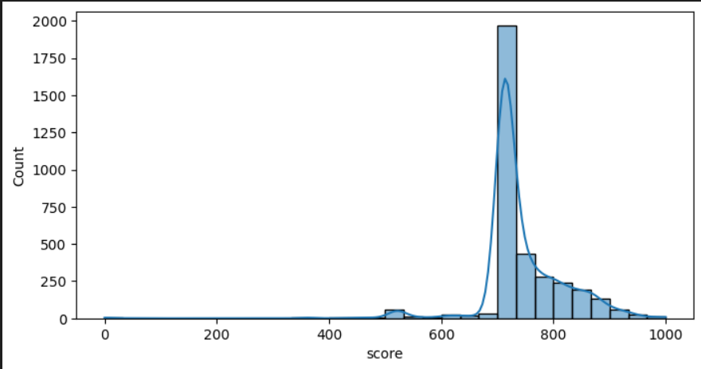
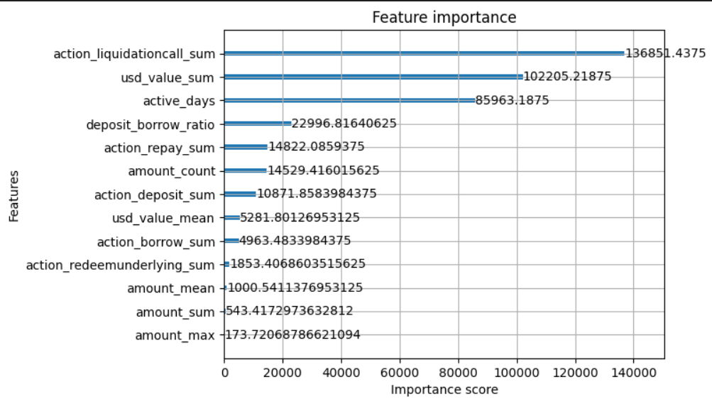

# Analysis Report

## Overview

This analysis is based on historical transaction data from the Aave V2 protocol. Wallets are scored on a scale from **0 to 1000**, with higher scores indicating safer and more responsible DeFi behavior.

The scoring logic incorporates several behavioral features:
- Total transaction volume (in USD)
- Repayment behavior
- Liquidations
- Borrow-to-deposit ratio
- Activity duration and frequency

---

##  Score Distribution

The distribution of credit scores respresentation using histogram (the values are appoximated for visual representation ):

Distribution graph across the ranges from 0–100, 100–200, etc.

---

## Behavioral Insights

### 🟥 Low Score Wallets (0–200)

- High borrow activity without corresponding repayment.
- Frequent liquidation events.
- Minimal interaction with protocol — low transaction count.
- Short lifespan on the protocol.
- Bot-like or exploitative patterns observed.

### 🟨 Mid Score Wallets (400–700)

- Moderate transaction volume and action diversity.
- Partial repayment behavior observed.
- Average activity duration and frequency.
- Balanced borrow and deposit behavior.

### 🟩 High Score Wallets (800–1000)

- High deposit and repayment volumes.
- Long-term protocol engagement with frequent transactions.
- Little to no liquidation history.
- High deposit-to-borrow ratio — indicating safe usage.
- Likely to be responsible and experienced DeFi users.

---

## Feature Impact Summary (I used my own logic it can be changed later according to company needs ) (only used for training the model )

| Feature                   | Effect on Score     |
|---------------------------|---------------------|
| `usd_value_sum`           | Positive (scaled +200) |
| `action_repay_sum`        | Positive (scaled +150) |
| `action_liquidationcall_sum` | Strong Negative (–100 each) |
| `action_borrow_sum`       | Mild Negative (scaled –150) |
| `active_days`             | Positive (scaled +100) |
| `amount_count`            | Positive (scaled +50) |
| `deposit_borrow_ratio`    | Positive (scaled +100) |

### This code avaiable in utils/score_applier.py

---
## Correalation Matrix Along with Score

## Insights Found by Me 

The scores are hitting 0 due to very high liquidation and high borrowing without repaying it, Out of 3497 wallets 6 of them falls under 200 score 

Few Wallets hitting perfect scores because they  get through very little negative rewards by the logic (remember we also used clip function in predict so >1000 is also 1000 ) ,  Out of 3497 wallets 7 of them hit perfect score  

Model Important Score differs from correlation we have observed , this is due to model is non-linear and it finds how much the attribute affects the score along with other attributes

## Limitations of my work

- I used  heuristic scoring function, not backed by real repayment behavior
- I treated all data equally , as it may depend on the user behavior (few people act differently in different market phases.) 
- I dont have ground truth scores to compare , so model evaluation is based on internal score only.

## 🧾 Conclusion

The credit scoring framework developed demonstrates strong correlation between responsible DeFi behavior and higher scores. The model penalizes risky actions like liquidation and overborrowing while rewarding consistent engagement and repayment behavior. This system can be used as a baseline scoring mechanism for credit-based DeFi protocols.

